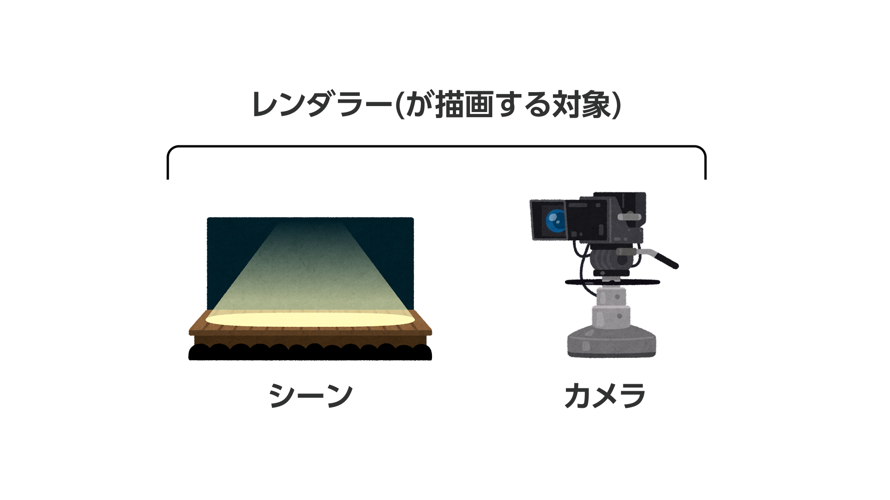

# three.js + Blenderで3DCGを実装する


## 挨拶・自己紹介

みなさんこんばんは。
今日は「three.js + Blenderで3DCGを実装する」という内容でお話します。

セッションの内容に入る前に少しだけ自己紹介をさせてください。
私はQiita株式会社でデザイナーをしている綿貫佳祐といいます。


Qiitaでは、エンジニア向け情報共有サービスのQiita、社内向け情報共有サービスのQiita Team、エンジニアと企業のマッチングサービスのQiita Jobsと3つのサービスを運営しています。


ここに来てくださっているみなさんでしたら、日頃Qiitaを使ってくださっている可能性も高いのかな？と思っています。
もしよろしければ、今日学んだ内容をもとにQiitaで記事を書いてください！
アドベントカレンダーも開催中なので、ぜひよろしくお願いします！


## このセッションの目標


さて自己紹介と宣伝もほどほどに、内容に入っていきたいと思います。
このセッションで一番実現したいのは「細かいことはともかく『動かせる3DCGを実装できそう』と思える」ことです。


突然なんですが、みなさん3DCGを使ったWebサイト制作にどんな印象を持っていますか？


私の周りでは「格好いいし作ってみたいけど、難しそうで手が出せない」という人が結構います。


たしかにガチでやろうとすると非常に難しい分野ですが、もったいなく感じてしまいました。
そのため、今日は「細かい原理とか理屈は抜きにして、動かして楽しいと思える」を一番大事にしてお話します。


イメージ的には、JavaScriptの基礎も知らないままだけど、とりあえずjQueryでアニメーションを実装できてキャッキャしていたあの頃の気持ちをもう一度手に入れる感じです。

## 完成品


今日の一連の流れを実施すると、このようなものが完成します。

- 3DCGを書き出した画像や動画ではなく、ブラウザ上で描画された3DCG
- マウスの動きにあわせて要素が動く
- スクロールにあわせて要素が動く


## ハンズオンの流れ


では、ざっくりとハンズオンの流れをお伝えします。
次の4ステップで進めていきます。

1. three.jsの起動
2. Blenderからの書き出し
3. three.jsにインポートして画面に表示
4. 操作に合わせて画面を動かす


## three.jsの起動


まずはとにかく起動してみます。
設定済みで、コマンドを叩くだけで起動するようなコードを配布していますのでご安心ください。

`codes`フォルダに移動して、依存関係をインストールした後`dev`コマンドを叩きます。
するとグレーの画面が表示されました。


JavaScriptを見てみましょう。
ファイル名は[0-base.js](../codes/0-base.js)です。

これらのコードは一度に存在しないとエラーになってしまうので、最初からセットとして用意しています。

まず1行目は単なるインポート宣言です。

```javascript
import * as THREE from "three"; // three.jsの読み込み
```

次は、レンダラーといって画面を描画するためのシステムのようなものを設定します。
画面の幅と高さを取得して渡しているだけなので、ほぼ暗記というか、コピペで大丈夫です。

```javascript
const renderer = new THREE.WebGLRenderer(); // レンダラー = 画面を描画するためのシステム
renderer.setSize(window.innerWidth, window.innerHeight); // レンダラーが描画する大きさを指示している
```

次は、HTMLのどこに3DCG要素を埋め込むか、ということですね。
ここも、id名が変わるかな？くらいで、コピペで大丈夫です。

```javascript
const renderArea = document.getElementById("render"); // HTML内の、idがrenderの要素を取得
renderArea.appendChild(renderer.domElement); // 上で取得した要素に、three.jsの出力先であるcanvas要素を追加する
```

コピペでOKばかり言う講師もどうなんだって話はありますが、細かく説明すると全然楽しいところまで行けないので、今は「ふーん」と思って聞いてください。

次はシーンといって、要素を配置するステージのようなものを設定します。
シーンの中に、オブジェクトやライトをあれこれ追加して、3DCGの世界を作ります。
今の記述は言うなれば「何もないステージに背景色だけ指定した」状態です。

```javascript
const scene = new THREE.Scene(); // シーン = 要素を配置するステージのようなイメージ
scene.background = new THREE.Color(0xeeeeee); // ステージの背景色
```

次はカメラの設定です。
世界があっても、それを覗くカメラがないと見ることができません。
カメラの画角やカメラを置く位置、向きなどを決めています。

```javascript
const camera = new THREE.PerspectiveCamera(
  30,
  window.innerWidth / window.innerHeight,
  0.1,
  1000
); // パースのついたカメラ。他にも種類がある
camera.position.set(2, 3, 5); // カメラの位置。XYZで座標を指定する
camera.lookAt(new THREE.Vector3(0, 0, 0)); // カメラの向き。今回は原点に向けている
```

次は、作ったシーンとカメラをレンダラーに渡して、実際に描画する関数です。
そして描画を実行しています。

```javascript
const render = () => {
  renderer.render(scene, camera); // レンダラーにシーンとカメラを渡し、描画している
};

render();
```

たくさん用語が出てきましたので、一度軽くまとめておきましょう。
このようになっています。




背景がグレーなだけの状態では何も分かりませんから、簡単なオブジェクトを配置してみましょう。
[1-get-start.js](../codes/1-get-start.js)に切り替えます。

ジオメトリーという形状を司るものと、マテリアルという材質を司るものを定義します。
メッシュという、言うなれば「普通の3Dオブジェクト」にジオメトリーとマテリアルを渡した上で、シーンに追加します。

```javascript
const geometry = new THREE.BoxGeometry(1, 1, 1); // ジオメトリー = 形状
const material = new THREE.MeshPhysicalMaterial({
  color: 0x55c500,
  transmission: 1,
  reflectivity: 1,
}); // マテリアル = 素材
const cube = new THREE.Mesh(geometry, material); // メッシュ = いわゆる3Dのオブジェクト。
scene.add(cube); // シーンにキューブを追加
```

また用語が出てきましたので、一度軽くまとめておきましょう。
このようになっています。


ちなみに、ぬるっとライトを指定していましたが、指定しないとこうなります。
何も指定していない状態ではこの世界には明かりがないので、面ごとの明るさに違いがありません。
立体的に見せるにはライトが必須です。

そう、こういう一連の流れを経ないとオブジェクト1つ設定できないのが大変なんです。
この調子で最初に見せた見本のようなものを作るの、だいぶ途方もないですよね？
これらをスキップして分かりやすくするためにBlenderと組み合わせようじゃないか、というのが今回のセッションです。

## Blenderからの書き出し


ここからは一度コードから離れ、Blenderを使ってデータを作ります。
今日は操作説明はせず連携方法に終始するんですが、無料で多機能なソフトなので気になった方はぜひ試してみてください。

今回Blenderでは[このようなデータ](../scenes/original.blend)を作りました。
画面上に描画するオブジェクトだけでなく、カメラやライトもBlender上で作成しています。
こちらのデータも配布していますので、好きに改造して遊んでみてください。

さてこれらをthree.jsで使えるように書き出します。

`File > Export > glTF 2.0 (.glb/.gltf)`を開きます。
ウィンドウ右側の`Include`を開いて、`Cameras`と`Punctual Lights`にチェックを入れます。
何もしないとカメラ情報とライト情報は書き出されないため、このオプションを有効にする必要があります。
また、`Apply Modifiers`も念のためチェックを入れておく方がいいです。
イメージとしてはラスタライズのような感じの処理です。


あとは`Export glTF 2.0`を押して完了です。
今回サンプルデータでは既に`assets`フォルダに格納していますが、実際の場合もプロジェクトの任意のフォルダに格納して使います。

## three.jsにインポートして画面に表示


それではthree.jsに戻って、先ほどのBlenderから書き出したデータを適用しましょう。
[2-import-gltf.js](../codes/2-import-gltf.js)に切り替えます。

まずは`GLTFLoader`というものをインポートします。

```javascript
import { GLTFLoader } from "three/examples/jsm/loaders/GLTFLoader"; // gLTFファイルを使うために必要
```

次に、先ほど設定したシーンやカメラ、オブジェクトのコードをすべて削除します。
これは、Blenderで設定した内容を使うからです。

```diff
  const scene = new THREE.Scene();
- scene.background = new THREE.Color(0xeeeeee);
  
- const camera = new THREE.PerspectiveCamera(
-   30,
-   window.innerWidth / window.innerHeight,
-   0.1,
-   1000
- );
- camera.position.set(2, 3, 5);
- camera.lookAt(new THREE.Vector3(0, 0, 0));
  
- const render = () => {
-   renderer.render(scene, camera);
- };
- 
- const geometry = new THREE.BoxGeometry(1, 1, 1);
- const material = new THREE.MeshPhysicalMaterial({
-   color: 0x55c500,
-   transmission: 1,
-   reflectivity: 1,
- });
- const cube = new THREE.Mesh(geometry, material);
- scene.add(cube);
- 
- const directionalLight = new THREE.DirectionalLight(0xffffff, 5);
- directionalLight.position.set(-5, 5, 5);
- scene.add(directionalLight);

  render();
```

`GLTFLoader`をインスタンス化し、Blenderで作ったシーンのパスとコールバック関数を渡します。
今回は簡単に、gltf内の`scene`をthree.jsの`scene`に追加して、gltf内の`camera`をthree.jsの`camera`として設定します。

```javascript
let camera; // 後から上書きする都合上、let
const loader = new GLTFLoader(); // gLTFファイルを使うために必要
loader.load(
  "assets/scene.glb", // gLTFファイルへのパス
  (gltf) => {
    const model = gltf.scene; // gltf.sceneにBlenderで作ったシーンがすべて入っている
    scene.add(model); // シーンにモデルを追加
    camera = gltf.cameras[0]; // gltf.camerasにBlenderで定義したカメラが配列で入っている
    render();
  }
);
```


ブラウザに戻ってみましょう。
さっきBlenderで見たのと似た感じの雰囲気にはなっていますが、色がおかしすぎますね。
次にこちらを修正していきます。
[3-adjust-color.js](../codes/3-adjust-color.js)に切り替えます。

これも難しい話をするとどこまでも難しくなるので、今回は設定内容を紹介するばかりです。
`physicallyCorrectLights`と`outputEncoding`と`toneMapping`と、割とBlenderに近い見た目になります。
これは、Blenderの初期設定とthree.jsの初期設定が違うために起こるものです。

```javascript
renderer.physicallyCorrectLights = true; // 物理ベースのライティング計算になる設定
renderer.outputEncoding = THREE.sRGBEncoding; // sRGBに適したエンコードになる設定
renderer.toneMapping = THREE.ACESFilmicToneMapping; // ダイナミックレンジの違いを上手く表現するための設定
```

あとはBlenderはデフォルトで環境光というものが設定されている状態です。
three.jsは真っ暗闇でBlenderは少しだけ明るい空間、とイメージしてください。
Blenderでの環境を再現するためにライトも追加します。

```javascript
const ambientLight = new THREE.AmbientLight(0x3b3f40, 1); // 環境光
scene.add(ambientLight);
```

あと、実は今は影がありません。
陰影のうち陰はあるけど影がないんですね。


というわけで影をつけます。
[4-add-shadow.js](../codes/4-add-shadow.js)に切り替えます。

デフォルトでは影を落とす設定がオフになっているので、オンにします。

```javascript
renderer.shadowMap.enabled = true; // レンダラー全体で影を有効にする
```

ただしこれだけではまだ有効になりません。
世界全体に「影をつける」指示をしただけで、どの要素に影が落ちるかも指示する必要があります。

ここで、`forEach`っぽい関数が用意されていて、`traverse`といいます。
これを先ほど定義した`model`に対して実行します。
オブジェクトの名前が`Key_Light`だったら、影を落とすようにします。
この名前はBlenderデータでつけた名前と同じなので、分かりやすい名前をつけてから書き出すようにしておきましょう。
そして、オブジェクトがMeshという、いわゆる普通のオブジェクトだったら影が出るように指定します。

```javascript
model.traverse((object) => { // forEachっぽい関数
  if (object.name === "Key_Light") { // Blenderで指定した名前で条件を組める
    object.castShadow = true; // 影を落とすかどうか
  } else if (object.isMesh && object.name !== "Background") { // isMesh = メッシュ、つまりいわゆる普通のオブジェクトかどうかの判定
    object.castShadow = true;
    object.receiveShadow = true; // 影を受けるかどうか
  }
});
```


これで、静止した見た目としてはかなり良い感じになりました。
影があると要素どうしの距離感とかも感じやすくて良いですね。

ただ、これならjpgか何かで書き出してbackground-imageを設定すれば良いですよね。
やはり操作にあわせて色々動かしたいので、次はそちらにとりかかります。

## 操作に合わせて画面を動かす


[5-move-objects.js](../codes/5-move-objects.js)に切り替えます。

準備として、`render`の中でde`requestAnimationFrame`を呼びます。
これをしないと、画面が更新されません。

```diff
  const render = () => {
+   requestAnimationFrame(render); // アニメーションする際に必要な設定
    renderer.render(scene, camera);
  };
```


動かす準備をした上で、マウスの動きにあわせてオブジェクトが回転するようにしましょう。
`Vector2`という、2次元座標を表すオブジェクトをインスタンス化します。
1つは空で、マウスの座標を格納する用。
1つはウィンドウの半分を取得して計算に使う用です。

```javascript
const mouse = new THREE.Vector2(); // マウスの座標を格納するための定義
const windowHalf = new THREE.Vector2(
  window.innerWidth / 2,
  window.innerHeight / 2
); // マウスの座標を-1から1の間にマッピングするための定数
```

`addEventListener`で`mousemove`の関数を書きます。
今いる座標を-1~1の範囲に変換し、`mouse`に代入します。
そうしたらまた`traverse`で、各要素の回転のプロパティに代入します。
これにより、マウスを動かすとそれに呼応して要素が回転するようになりました。

```javascript
window.addEventListener("mousemove", (event) => {
  mouse.x = (event.clientX - windowHalf.x) / windowHalf.x; // x座標が-1から1にマッピングされる
  mouse.y = (event.clientY - windowHalf.y) / windowHalf.y; // y座標が-1から1にマッピングされる
  scene.traverse((object) => { // forEachっぽい関数
    if (object.isMesh && object.name !== "Background") {
      object.rotation.z = mouse.x / 4; // マウスのx座標にあわせてz軸回転
      object.rotation.x = mouse.y / 4; // マウスのy座標にあわせてx軸回転
    }
  });
});
```

次に、マウスの位置にあわせて光源も追加してしまいましょう。
[6-add-light-effect.js](../codes/6-add-light-effect.js)に切り替えます。

ライトを1つ定義してシーンに追加します。

```javascript
const mouseLight = new THREE.PointLight(0xf6c032, 10); // マウス操作にあわせて動かすライトを定義
mouseLight.position.set(0, 0, 5); // 初期位置を定義
scene.add(mouseLight);
```

その上で、`mousemove`の中でポジションを上書きします。
これにより、マウスに光が追従して、更にインタラクティブっぽい雰囲気になりました。

```diff
  window.addEventListener("mousemove", (event) => {
    mouse.x = (event.clientX - windowHalf.x) / windowHalf.x;
    mouse.y = (event.clientY - windowHalf.y) / windowHalf.y;
+   mouseLight.position.x = mouse.x * 4; // マウスの位置にあわせてmouseLightの位置を変更
+   mouseLight.position.y = mouse.y * -4; // マウスの位置にあわせてmouseLightの位置を変更
    scene.traverse((object) => {
      if (object.isMesh && object.name !== "Background") {
        object.rotation.z = mouse.x / 4;
        object.rotation.x = mouse.y / 4;
      }
    });
  });
```

更に、スクロールにあわせても動くようにします。
[7-add-scroll-effect.js](../codes/7-add-scroll-effect.js)に切り替えます。

`canvas`要素を取得しつつ、`addEventListener`で`scroll`の関数を書きます。
またも`traverse`で、各要素の回転のプロパティに代入します。
これによりスクロールにあわせて要素が回転します。

```javascript
const canvas = document.querySelector("#render canvas"); // three.jsの要素が描画されるcanvasの取得
window.addEventListener("scroll", () => {
  scene.traverse((object) => { // forEachっぽい関数
    if (object.isMesh) {
      object.rotation.y = (window.screenTop - window.pageYOffset) / -720; // スクロール位置にあわせてy軸回転
    }
  });
});
```

あとは3Dでもなんでもないオマケみたいなスタイルを書いてあげれば、良い感じのインタラクションになります。

```diff
  const canvas = document.querySelector("#render canvas"); // three.jsの要素が描画されるcanvasの取得
  window.addEventListener("scroll", () => {
    scene.traverse((object) => { // forEachっぽい関数
      if (object.isMesh) {
        object.rotation.y = (window.screenTop - window.pageYOffset) / -720; // スクロール位置にあわせてy軸回転
      }
    });
+   if (window.pageYOffset <= window.innerHeight) { // 3DCGも何も関係ない、単なるスタイル変更
+     const scrollRatio = window.pageYOffset / window.innerHeight;
+     canvas.style.width = `${100 - scrollRatio * 10}%`;
+     canvas.style.height = `${100 - scrollRatio * 10}%`;
+     canvas.style.borderRadius = `${scrollRatio * 32}px`;
+   }
  });
```

最後に仕上げとして、ウィンドウがリサイズされたときの処理を書いておきます。
[8-resize.js](../codes/8-resize.js)に切り替えます。

`addEventListener`で`resize`の関数を書きます。
最初の方に書いたような内容をリサイズ時にも発生させるだけです。

```javascript
window.addEventListener("resize", () => {
  camera.aspect = window.innerWidth / window.innerHeight; // アスペクト比の取得し直し
  camera.updateProjectionMatrix(); // アスペクト比の変更の反映
  renderer.setSize(window.innerWidth, window.innerHeight); // サイズの取得し直し
  windowHalf.x = window.innerWidth / 2; // windowHalfの取得し直し
  windowHalf.y = window.innerHeight / 2; // windowHalfの取得し直し
  render();
});
```

## 完成

以上で完成です。

できるだけ細かいことは抜きにして説明しましたが、多少は感覚が掴めたでしょうか？
「なんとなく自分もできるかもしれない」という気持ちが芽生えていれば嬉しいです。

20分ちょっとの時間では省略せざるを得ない箇所もありましたが、コピペで他のデータにも転用しやすいコードにはしているつもりです。
まずはコピペでも良いから「お！動かせるかも！」と感じるのが大事だと思います。
そのうち興味を持って「ここの色を変えるにはどうしたら良いんだ」とか「もっと綺麗な影を描画するにはどうしたら良いんだ」とか手を加えていってもらえたら、もう感無量です。

それではご清聴ありがとうございました。


